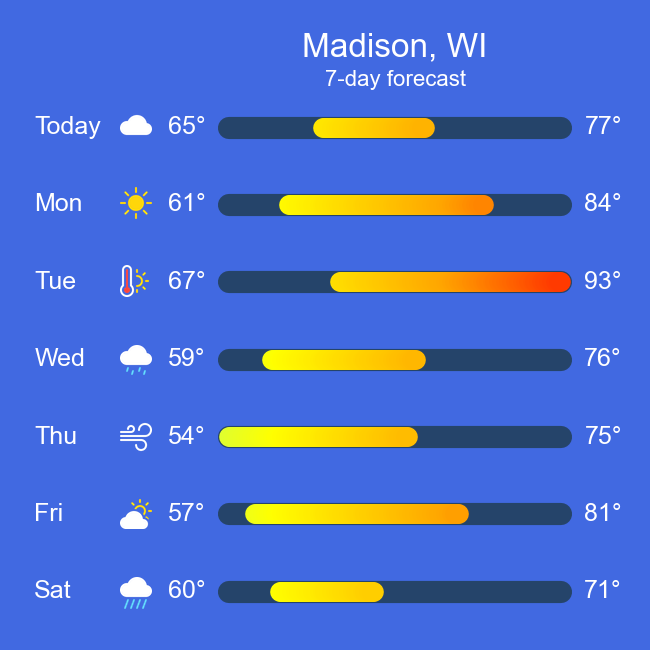
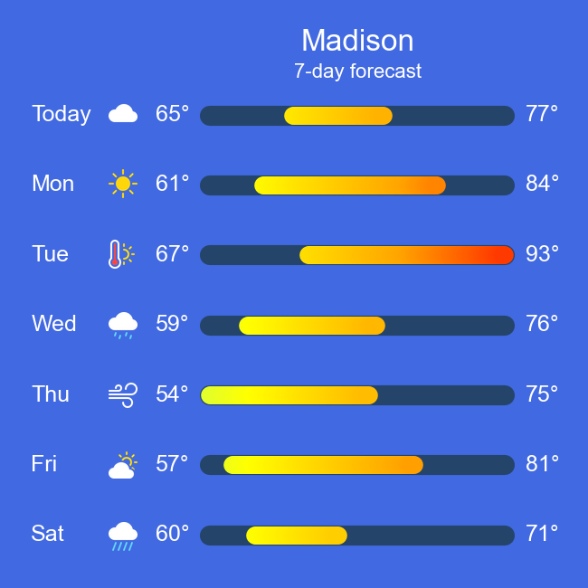
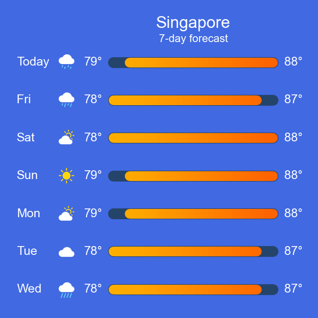
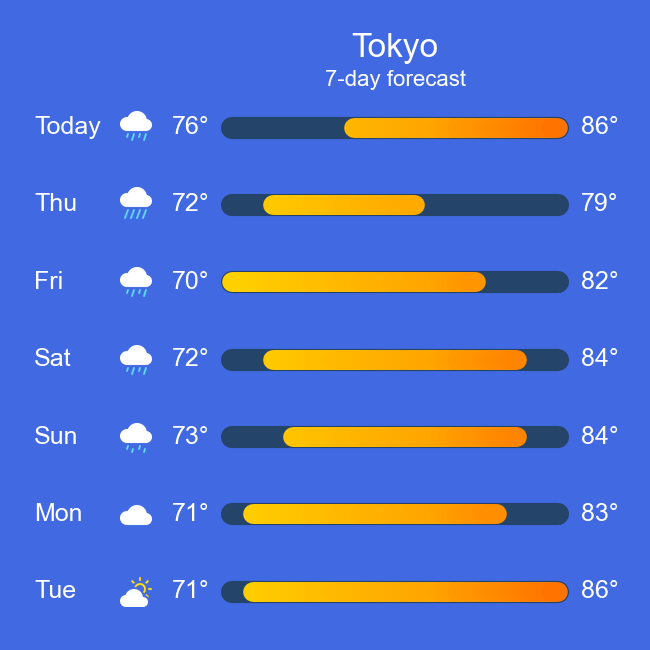
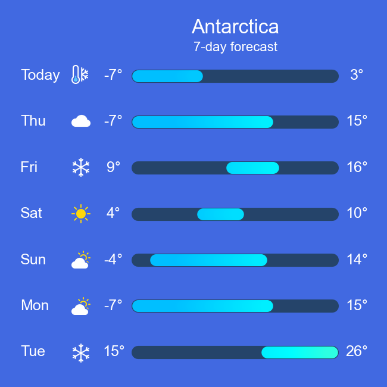
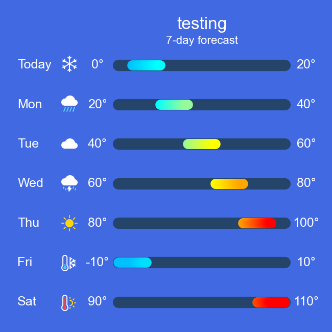

# Weather forecast plot

This is my contribution to the [2024 Plotnine Contest](https://github.com/has2k1/plotnine/discussions/788).
It's inspired by the Apple Weather app.



View the [jupyter notebook](./weather_forecast.ipynb) for the code and a walkthrough of generating this plot including several prototypes working up to the final plot.
The python code imports `plotnine` and `polars`.
The weather icons were modified from the [Bootstrap Icons](https://icons.getbootstrap.com/) library.

## Motivation

While working out what to do in this project I was motivated by these factors:

1. Provide visual demonstration of something where there isn't a visual example in the plotnine documentation's [reference](https://plotnine.org/reference/), [gallery](https://plotnine.org/gallery/), or [tutorials](https://plotnine.org/tutorials/) pages
1. Make something beautiful
1. Make something that I didn't know how to make already
1. Explain it well

The data for this plot is quite simple and is very different from the large data sets I work with on a typical day.
However, creating the polished plot has some interesting challenges and I hope that even many experienced plotnine users will see this plot, wonder how it was made, and want to check out the code to understand it.

Regarding point 1, this plot includes a visual demonstration of [`watermark`](https://plotnine.org/reference/watermark.html), which I didn't find a visual example of in the documentation (but I may have missed it).
Although the code uses the `watermark` feature to add images that aren't meant to serve as  watermarks, I think the result looks really nice.
Credit to the question asked in this [GitHub issue](https://github.com/has2k1/plotnine/issues/661) for helping me notice the `watermark` feature and its ability to add images to a plot.

The [jupyter notebook](./weather_forecast.ipynb) includes several prototypes that explore different ideas and strategies on the way to the final plot.
My experience is that creating a new plot and making it look polished is a very iterative process.
The tweaking to get something that looks really good can take a lot of time plus trying out many different things.

## Generate the plot

If you want to generate the plot yourself, run the jupyter notebook or clone the repository and run the code below.
Note that my output was generated running polars 0.20.13 and plotnine 0.13.6 on python 3.10.13.

```python
from plot_forecast import plot_forecast
plot_forecast('./data/Madison.csv', location='Madison, WI', outfile='Madison.png')
```

`plot_forecast.py` was tested with more locations encompassing a wider variety of temperatures and temperature ranges versus the jupyter notebook.
A little bit of code differs in `plot_forecast.py` to handle this wider variety and this is noted in the comments.

Here are a few plots generated with this function:

<table>
  <tr>
    <td></td>
    <td></td>
    <td></td>
  </tr>
  <tr>
    <td></td>
    <td></td>
    <td></td>
  </tr>
</table>


## Acknowledgements

Thank you to:

* [has2k1](https://github.com/has2k1) for organizing the contest and all the work on `plotnine`
* Everyone that has contributed to `plotnine`
* The Bootstrap team and contributors for Bootstrap Icons (and the Bootstrap framework: even though it isn't used in this project, it's a helpful part of other work I do)